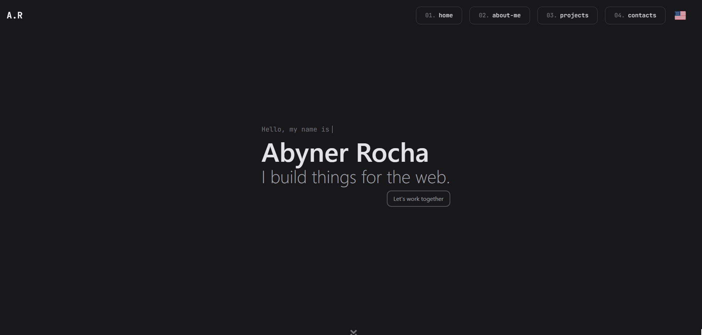

# 💻 My Personal Portfolio

Welcome to my portfolio repository! This space was created to showcase and centralize my main projects, technical skills, and growth as a technology professional.



🌐 **Access the portfolio here:** [Click here](https://abynerrocha.vercel.app)

---

## 👤 About Me

Hello! My name is **Abyner Rocha** and I am a **FullStack Developer**.

* 🚀 Currently focused on: React and NodeJS with TypeScript
* 🌐 Experience with PHP
* 🎓 Education: Self-taught since the age of 12
* 💼 Goal: Looking for opportunities as a Junior Developer

---

## 🛠️ Technologies and Tools

Here are the main technologies I work with on a daily basis:

| Category           | Technologies                     |
| :----------------- | :------------------------------- |
| **Front-End**      | NextJS, TypeScript, Tailwind CSS |
| **Tools / DevOps** | Git, GitHub, Vercel              |

---

## 🎨 Website Design and Features

* **Responsive Design:** Fully adapted for mobile devices, tablets, and desktops.
* **Multilingual Website:** Available in both Portuguese and English.

---

## 🚀 How to Run the Project Locally

If you want to clone this portfolio and run it on your machine:

1. Clone the repository:

   ```bash
   git clone https://github.com/AbynerRocha/portfolio
   ```

2. Enter the project directory:

   ```bash
   cd portfolio
   ```

3. Install the dependencies:

   ```bash
   npm install
   ```

4. Start the development server:

   ```bash
   npm run dev
   ```

---

## ✉️ Contact

Let’s connect! You can find me through the channels below:

* [My LinkedIn](www.linkedin.com/in/abynerrocha)
* Email: [abynerr.rocha@gmail.com](mailto:abynerr.rocha@gmail.com)

⭐ Developed with ❤️ by [Your Name]. If you liked the project, leave a star!
